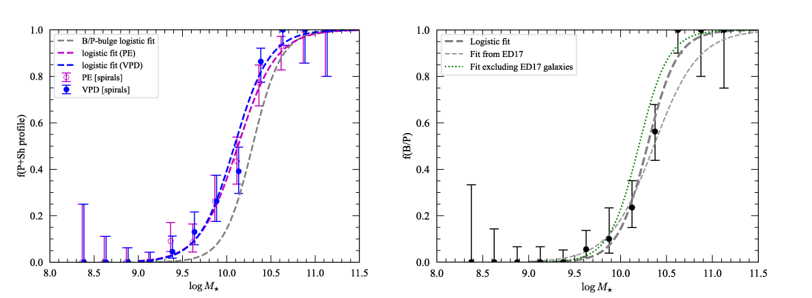

# Public data and code for paper analyzing bar-major-axis profiles

This git repository contains data files and Python/R code which can be used to reproduce figures and analyses
from the paper "The Profiles of Bars in Barred Galaxies" (Erwin,
Debattista, & Anderson 2023, *Monthly Notices of the Royal Astronomical
Society*, in press).




Logistic fits for Peak+Shoulders bar profiles (left) and B/P-bulge presence (right)
for barred spirals, versus galaxy stellar mass.

<!-- [](https://zenodo.org/badge/latestdoi/86151029) -->
[](https://zenodo.org/badge/latestdoi/579425923)


## Data

The full set of *Spitzer* 3.6-micron images for the sample galaxies can be found
at, e.g., the [NASA Extragalactic Database](https://ned.ipac.caltech.edu); to
make it easier to reproduce Figure 1 of the paper, we include sky-subtracted
versions of these images for three of the galaxies in the `data/images` folder.


## Dependencies

The Python code requires the following external Python modules and packages,
all of which are available on PyPI and can be installed via `pip`:

   * [Numpy](https://www.numpy.org), [Scipy](https://www.scipy.org), 
   [matplotlib](https://matplotlib.org), [Astropy](https://www.astropy.org),
   [scikit-image](https://scikit-image.org), [pandas](https://pandas.pydata.org),
   [statsmodels](https://www.statsmodels.org)


## Plain Scripts

The original notebooks have been converted to plain scripts for this PC:

   * `barprofiles_figures_for_paper.py` -- Python script; generates the figures for
   the paper

   * `barprofiles_R_logistic_regression.R` -- R script; computes logistic
   regressions

   * `barprofiles_python_logistic_regression.py` -- Python-only replacement for
   the R logistic-regression script; computes the same binomial GLM fits using
   `statsmodels` and writes outputs to `python_logistic_output`

The Python script resolves paths relative to its own folder, creates a local
`python_figure_output` directory, and skips optional image figures whose full Spitzer image
archive is not present. The public repository includes the three images needed
for Figure 1 in `data/images`.


## Python Code

   * `angle_utils.py`, `barprofile_utils.py`, `plotutils.py` -- miscellaneous utility functions
   (including statistics).
   
## How to Generate Figures and Analyses from the Paper

1. Download this repository.

2. Install the Python dependencies:

   ```powershell
   python -m pip install -r requirements.txt
   ```

3. Run the Python figure script:

   ```powershell
   python barprofiles_figures_for_paper.py
   ```

   If `python` is not on PATH, run the script with the repository virtual
   environment directly:

   ```powershell
   python barprofiles_figures_for_paper.py
   ```

   By default `savePlots = True`, so the script writes PDF figures into the
   local `python_figure_output` folder.

4. Run the Python logistic-regression script:

   ```powershell
   python barprofiles_python_logistic_regression.py
   ```

   If `python` is not on PATH, run:

   ```powershell
   python barprofiles_python_logistic_regression.py
   ```

   This writes `logistic_regression_summaries.txt` and
   `logistic_regression_coefficients.csv` into `python_logistic_output`.

5. **Fallback:** The original R script is still present and can be run to compare
   the logistic-regression output:

   ```powershell
   Rscript barprofiles_R_logistic_regression.R
   ```


## Licensing

Code in this repository is released under the BSD 3-clause license.

<a rel="license" href="http://creativecommons.org/licenses/by/4.0/">
</a><br />
Text and figures are licensed under a <a rel="license" href="http://creativecommons.org/licenses/by/4.0/">Creative Commons Attribution 4.0 International License</a>.
